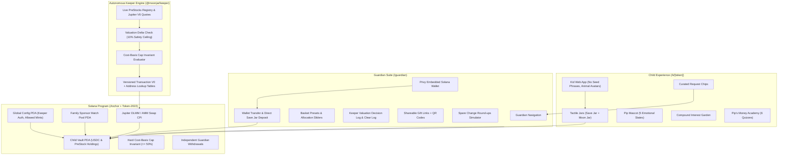

# 🍯 Moonjar

> **A family savings app for kids, powered by PreStocks on Solana.**

[-14F195?logo=solana&logoColor=white)](https://solana.com)
[](https://privy.io)
[](https://nextjs.org/)
[](./apps/web/src/lib/vault-client/)
[](https://spl.solana.com/token-2022)
[](#coppa-privacy--safety-invariants)

---

## What is Moonjar?

Moonjar teaches children responsible, patient wealth-building by separating savings into two distinct on-chain jars:

1. **The Save Jar**: Safe, stable digital dollars (USDC). Always accessible, earning steady yield, and never exposed to market volatility.
2. **The Moon Jar**: Hard-capped (default 20%, maximum 50% on-chain) exposure to tokenized private equity pioneers (SpaceX, OpenAI, Anthropic, Anduril, Figure AI, etc.) via **PreStocks**.

Moonjar is engineered around **calm psychology**:
- **No red numbers** for drawdowns.
- **Snapshot from earlier today**: Daily snapshots instead of live tickers to prevent screen addiction and dopamine spikes.
- **Cost-basis tracking**: The 20% cap measures cost basis deposited, not unrealized paper gains — meaning a 10x run-up in SpaceX never triggers an automated forced sale.
- **Autonomous Valuation Guard**: Algorithmic keeper rejects secondary market purchases whenever secondary DEX pricing exceeds primary round valuation by > 10% ("Too pricey").

---

## System Architecture



---

## Repository Structure

```
moonjar/
├── apps/
│   ├── web/             # Next.js 14 App: Privy embedded wallets, Pattern 2 pure client (89.8 kB bundle)
│   └── keeper/          # Autonomous TypeScript Keeper daemon (Versioned V0 swaps, 10% premium ceiling)
├── packages/
│   └── shared/          # Shared schemas (Zod), PreStocks registry, Flesch-Kincaid & banned-word linters
├── programs/
│   ├── vault/           # Anchor program: ChildVault PDA, cost-basis caps, match pool, Jupiter CPI
│   └── mock-swap/       # Offline CPI test harness for CI unit testing
├── runbooks/            # Surfpool infrastructure-as-code runbooks (instant cheatcode deployments)
├── scripts/
│   ├── fund.ts          # Instant SOL airdrop & USDC provisioning via Surfpool cheatcodes
│   ├── init-cluster.ts  # Global on-chain config initialization (Keeper authority & allowed mints)
│   └── spike.ts         # Milestone 1 feasibility validation against live PreStocks registry
├── tests/               # Anchor on-chain test suite (13 integration tests & Jupiter CPI suite)
├── ASSUMPTIONS.md       # Architectural decisions & documented mock boundaries
├── DEMO_SCRIPT.md       # Step-by-step interactive showcase tour
└── README.md            # Monorepo overview and quickstart guide
```

---

## Getting Started

### Prerequisites
- Node.js >= 18.18.0
- pnpm >= 9.0.0
- [Surfpool](https://surfpool.run) (`curl -sL https://run.surfpool.run/ | bash`)
- Solana CLI & Rust (for on-chain smart contract development)

---

### 1. Installation

```bash
git clone https://github.com/moonjar/moonjar.git
cd moonjar
pnpm install
```

---

### 2. Start the Local Surfpool Cluster

In a separate terminal, launch your local Surfpool cluster (forking Solana mainnet on-demand):

```bash
surfpool start --no-tui -y
```

Deploy the on-chain programs to Surfpool:
```bash
surfpool run deployment -u --env localnet
```

---

### 3. Initialize On-Chain Global Config

Initialize the on-chain `config` account with the keeper authority, Circle USDC mint, and allowed PreStocks mints:

```bash
pnpm init-cluster
```

---

### 4. Fund Your Guardian Wallet

Fund any Solana wallet (including your Privy embedded wallet) with 5 SOL for gas and test USDC:

```bash
pnpm fund <SOLANA_WALLET_ADDRESS> [USDC_AMOUNT]

# Example:
pnpm fund BBNyzG9Kn1xf8ZFbwK2nKr3XW4MGr4XE8pQ9iJ1rsi57 500
```

---

### 5. Launch the Web App & Keeper Daemon

Run both services concurrently:
```bash
pnpm dev
```

Or run each service individually:
```bash
# Next.js Web App (http://localhost:3000)
pnpm dev:web

# Autonomous Valuation Keeper Service
pnpm dev:keeper

# One-shot keeper evaluation scan
npx tsx apps/keeper/src/index.ts --once
```

---

## Core Invariants & Safety Invariants

### 1. Cost-Basis Moon Cap
- Enforced on-chain via basis points (`moon_cap_bps`).
- Default: `2000` (20%). Hard ceiling: `5000` (50%).
- Verified mathematically before every buy instruction:
  $$\text{new\_moon\_cost} = \text{moon\_cost\_basis} + \text{amount\_in} \le \frac{\text{total\_deposited} \times \text{moon\_cap\_bps}}{10000}$$
- **Market run-ups never force sales**: Unrealized gains do not increase the cost basis.

### 2. Valuation Protection (The 10% Safety Rule)
- Queries live Jupiter secondary quotes and calculates effective price per share.
- Compares against fundamental mark price from the PreStocks API.
- If $\text{premium} > 10.0\%$, the keeper automatically rejects the trade (`PREMIUM_TOO_HIGH` / "Too pricey").
- Funds remain 100% safe in USDC in the Save Jar.

### 3. Versioned Transactions & Address Lookup Tables (ALTs)
- Jupiter DLMM/AMM swaps frequently require 30+ accounts, which exceeds Solana's legacy 1,232-byte transaction MTU limit.
- Moonjar encodes all keeper purchases as **Versioned Transactions (v0)** with Address Lookup Tables, shrinking transactions from **1,658 bytes down to 510 bytes**.
- Injects `ComputeBudgetProgram.setComputeUnitLimit({ units: 800_000 })` to support complex multi-hop swaps.

### 4. Guardian Pause & Independent Withdrawal Rights
- Freezing buys and deposits does **NOT** block withdrawals.
- Guardians retain self-custody rights to withdraw Save Jar USDC or close positions at any time.

### 5. Strict Wallet & Vault Data Isolation
- Browser storage is strictly keyed to `moonjar_vault_state_<guardianWallet>`.
- The global un-scoped key is proactively purged on load.
- Decisions are strictly filtered by `d.vaultAddress === vault.metadata.vaultAddress` to guarantee zero cross-wallet leaks.

### 6. COPPA Privacy Invariants
- Zero private keys or signing capabilities on the child device.
- Zero third-party trackers, analytics, or external CDN assets.
- Child nicknames are hashed on-chain (`[u8; 32]`); avatars are friendly animals.
- Curated request chips prevent open-ended chat risks.

---

## Design System

- **Palette**: Paper (`#FAF8F5`), Ink (`#1F1B2E`), Buttercup (`#FFE853`), Lilac (`#A084E8`), Mint (`#38D39F`), Sky (`#70D6FF`), Coral (`#FF6584`).
- **Typography**: Self-hosted Atkinson Hyperlegible, Fredoka, and Nunito.
- **Sticker Aesthetic**: 3px solid ink borders, `4px 4px 0 #1F1B2E` offset drop shadows, tactile rounded pill buttons.
- **Pip the Mascot**: Custom responsive SVG otter mascot with 5 emotional states (`happy`, `curious`, `thinking`, `calm-reassuring`, `cheering`).

---

## Testing & Quality Assurance

```bash
# Run shared package unit tests (Zod schemas, copy linters, Flesch-Kincaid):
pnpm --filter @moonjar/shared test

# Run Anchor on-chain test suite:
anchor test

# Run Next.js production build verification:
pnpm --filter @moonjar/web build

# Run TypeScript typechecks across all workspaces:
pnpm --recursive run build
```

---

## License

MIT © Moonjar Contributors
