# 🍯 Moonjar

> **A family savings app for kids, powered by PreStocks on Solana.**

[](https://solana.com)
[](https://coral-xyz.github.io/anchor/)
[](https://nextjs.org/)
[](https://www.typescriptlang.org/)
[](#coppa-privacy--safety-invariants)

---

## What is Moonjar?

Moonjar teaches children responsible, patient wealth-building by separating savings into two distinct on-chain jars:

1. **The Save Jar**: Safe, stable digital dollars (USDC). Always accessible, earning steady yield, and never exposed to market volatility.
2. **The Moon Jar**: Hard-capped (default 20%, maximum 50% on-chain) exposure to tokenized private equity pioneers (SpaceX, OpenAI, Anthropic, Anduril, Figure AI, etc.) via **PreStocks**.

Moonjar is engineered around **calm psychology**:
- **No red numbers** for drawdowns.
- **Snapshot from earlier today**: Daily snapshots instead of live real-time tickers to prevent screen addiction and dopamine spikes.
- **Cost-basis tracking**: The 20% cap measures cost basis deposited, not unrealized paper gains — meaning a 10x run-up in SpaceX never forces an automated panic liquidation.

---

## System Architecture

```mermaid
flowchart TD
    subgraph ChildExperience ["Child Experience (/k/[token])"]
        KidApp["Kid Web App (No Seed Phrases, Animal Avatars)"]
        DualJars["Tactile Jars (Save Jar + Moon Jar)"]
        Pip["Pip Mascot (5 Emotion States)"]
        Garden["Compound Interest Garden"]
        Academy["Pip's Money Academy (6 Quizzes)"]
        Ask["Curated Request Chips"]
    end

    subgraph GuardianExperience ["Guardian Dashboard (/guardian)"]
        GNav["Guardian Navigation"]
        GBaskets["Basket Presets & Allocation Sliders"]
        GDecisions["Keeper Valuation Decision Log"]
        GGifts["Shareable Gift Links + QR Codes"]
        GRoundups["Spare Change Round-ups Simulator"]
        GKidLink["Tablet QR Pairing & COPPA Safety"]
    end

    subgraph KeeperService ["Autonomous Valuation Keeper (@moonjar/keeper)"]
        PricePoller["PreStocks Price & Valuation Delta Monitor"]
        ValuationEngine["Valuation Delta Check (Max 10% Premium)"]
        CapGuard["Cost-Basis Cap Invariant Evaluator"]
        SwapExecutor["Jupiter / Mock-Swap Devnet Route"]
    end

    subgraph SolanaOnChain ["Solana Program (Anchor)"]
        VaultPDA["Child Vault PDA (USDC & Token Holdings)"]
        CapInvariant["Hard Cost-Basis Cap (<= 50%)"]
        PauseSafe["Independent Guardian Withdrawals"]
        MatchPool["Family Sponsor Match Pool PDA"]
        GraduationLogic["18th Birthday Timestamp Unlock"]
    end

    KidApp --> DualJars
    DualJars --> VaultPDA
    Ask --> GNav
    GuardianExperience --> VaultPDA
    PricePoller --> ValuationEngine --> CapGuard --> SwapExecutor --> VaultPDA
    MatchPool --> VaultPDA
```



---

## Repository Structure

```
moonjar/
├── programs/
│   ├── vault/           # Anchor program: ChildVault PDA, cost basis caps, match pool, graduation
│   └── mock-swap/       # CPI swap program simulating Jupiter PreStocks routing on devnet
├── packages/
│   └── shared/          # Shared schemas (Zod), PreStocks types, Flesch-Kincaid & banned-word linters
├── apps/
│   ├── web/             # Next.js 14 Web Application (Guardian dashboard, Kid app, Gift pages)
│   └── keeper/          # Autonomous TypeScript Keeper daemon for price & valuation polling
├── tests/               # 13 Anchor integration tests (vault.ts)
├── ASSUMPTIONS.md       # Architectural decisions & documented mock boundaries
├── SPIKE.md             # Milestone 1 Jupiter route & mint feasibility report
└── DEMO_SCRIPT.md       # Step-by-step interactive showcase tour
```

---

## Getting Started

### Prerequisites
- Node.js >= 18.18.0
- pnpm >= 9.0.0
- Rust & Solana CLI (for on-chain program development)

### 1. Installation
```bash
git clone https://github.com/moonjar/moonjar.git
cd moonjar
pnpm install
```

### 2. Run the Full Application
```bash
# Run both the Next.js web application and the Keeper daemon concurrently:
pnpm dev
```

Or run each service individually:
```bash
# Web application (http://localhost:3000)
pnpm dev:web

# Keeper valuation daemon
pnpm dev:keeper

# Run keeper once for inspection
pnpm --filter @moonjar/keeper once
```

### 3. Run Automated Tests
```bash
# Run shared package unit tests (linter, reading levels, schemas):
pnpm --filter @moonjar/shared test

# Run Anchor on-chain test suite (local Solana test validator):
anchor test
```

---

## Core Invariants & Safety Rules

1. **Cost-Basis Cap**:
   - Stored in basis points on-chain (`moon_cap_bps`).
   - Default: `2000` (20%). Hard ceiling: `5000` (50%).
   - Verified before every buy instruction.
2. **Guardian Pause Safety**:
   - Pausing freezes algorithmic buys and deposits.
   - **Withdrawals are NEVER frozen**: The guardian can always withdraw USDC and claim tokens even when paused.
3. **Valuation Protection**:
   - Keeper rejects secondary market purchases if implied valuation exceeds primary round valuation by > 10%.
   - Slippage strictly capped at 100 bps (1%).
4. **COPPA Privacy & Safety**:
   - Zero private keys or signing capabilities on the child device.
   - Zero third-party trackers, external CDN assets, or telemetry.
   - Nicknames are hashed on-chain (`[u8; 32]`); avatars are playful animals.
   - Curated request chips prevent unsupervised chat risks.

---

## Design System

- **Palette**: Paper (`#FAF8F5`), Ink (`#1F1B2E`), Buttercup (`#FFE853`), Lilac (`#A084E8`), Mint (`#38D39F`), Sky (`#70D6FF`), Coral (`#FF6584`).
- **Typography**: Self-hosted Atkinson Hyperlegible, Fredoka, and Nunito.
- **Sticker Aesthetic**: 3px solid ink borders, `4px 4px 0 #1F1B2E` offset drop shadows, rounded pill buttons.
- **Pip the Mascot**: Custom responsive SVG otter mascot with 5 emotional states (`happy`, `curious`, `thinking`, `calm-reassuring`, `cheering`).

---

## License

MIT © Moonjar Contributors
