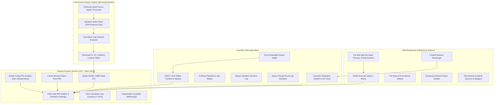

# 🍯 Moonjar

> **Autonomous Pre-IPO Savings Vault on Solana for the Next Generation.**
> A calm, educational family savings application powered by Token-2022 PreStocks, Privy embedded wallets, and an autonomous fiduciary valuation keeper.

[-14F195?logo=solana&logoColor=white)](https://solana.com)
[](https://privy.io)
[](https://nextjs.org/)
[](./apps/web/src/lib/vault-client/)
[](https://spl.solana.com/token-2022)
[](#coppa-privacy--safety-invariants)

---

## 📖 Table of Contents

1. [Overview & Philosophy](#-overview--philosophy)
2. [Dual Jar Mechanism](#-dual-jar-mechanism)
3. [System Architecture](#-system-architecture)
4. [Monorepo Structure](#-monorepo-structure)
5. [Prerequisites](#-prerequisites)
6. [Quickstart: Setup & Running Locally](#-quickstart-setup--running-locally)
7. [Core Safety Invariants](#-core-safety-invariants)
8. [Available Apps & Portals](#-available-apps--portals)
9. [Development & Testing Commands](#-development--testing-commands)
10. [Environment Variables Reference](#-environment-variables-reference)
11. [License](#-license)

---

## 🌟 Overview & Philosophy

Traditional fintech apps expose children to speculative gamification, volatile price charts, and high dopamine triggers. **Moonjar** takes a fundamentally different path built on **calm psychology**:

- **No red numbers**: Price dips are not displayed as flashing alarming red numbers; child savings are framed as long-term wealth building.
- **Daily snapshots**: Replaces live ticking charts with calm daily snapshot checks to prevent screen addiction.
- **Cost-basis tracking**: The Moon Jar cap (default 20%, maximum 50%) is mathematically calculated against *deposited cost basis*, not paper gains. A 10x rise in SpaceX never triggers an automated forced sale.
- **Autonomous Valuation Guard**: The fiduciary Keeper engine refuses secondary market DEX buys whenever price exceeds fundamental primary valuation by $> 10\%$ ("Too pricey").
- **COPPA Compliant & Zero Seed Phrases**: Parents authenticate seamlessly via Privy embedded wallets (email/social). Kids access their view via a private capability URL (`/k/[token]`) with zero keys or signing capabilities.

---

## 🍯 Dual Jar Mechanism

```
               ┌───────────────────────────────┐
               │    Total Savings Inflow       │
               │   (Allowance, Gifts, Roundups)│
               └───────────────┬───────────────┘
                               │
            ┌──────────────────┴──────────────────┐
            ▼                                     ▼
 ┌──────────────────────┐              ┌──────────────────────┐
 │    🍯 Save Jar       │              │    🚀 Moon Jar       │
 │                      │              │                      │
 │ • 100% Circle USDC   │              │ • Tokenized Pre-IPO  │
 │ • Zero volatility    │              │   Equities (SpaceX,  │
 │ • Liquid & redeemable│              │   OpenAI, Anduril)   │
 │ • Default 80% alloc  │              │ • Hard 20% cost cap  │
 └──────────────────────┘              └──────────────────────┘
```

1. **The Save Jar**: Bedrock capital held in safe digital dollars (USDC). Always accessible, independent guardian withdrawal rights, and shielded from volatility.
2. **The Moon Jar**: Hard-capped exposure to private market pioneers via PreStocks Token-2022 assets. Purchases are executed autonomously in micro-batches by the Keeper engine when valuations are fair.

---

## 🏗️ System Architecture



---

## 📁 Monorepo Structure

```
MoonJar/
├── apps/
│   ├── web/             # Next.js 14 Web App: Guardian Suite, Child Portal, Pattern 2 pure Web3 client
│   └── keeper/          # Autonomous TypeScript Keeper bot: Versioned V0 swaps, 10% premium ceiling
├── packages/
│   └── shared/          # Shared Zod schemas, PreStocks registry, Flesch-Kincaid & banned-word linters
├── programs/
│   ├── vault/           # Anchor program: ChildVault PDA, cost-basis caps, match pool, Jupiter CPI
│   └── mock-swap/       # Offline CPI test harness for deterministic Anchor unit tests
├── runbooks/            # Surfpool infrastructure-as-code runbooks (instant program deployment)
├── scripts/
│   ├── fund.ts          # Instant SOL airdrop & USDC balance provisioning via Surfpool cheatcodes
│   ├── init-cluster.ts  # Global on-chain config initialization (Keeper authority & allowed mints)
│   └── spike.ts         # PreStocks registry and pricing validation probe
├── tests/               # Anchor on-chain test suite (13 integration tests & Jupiter CPI suite)
├── Anchor.toml          # Anchor program deployment & cluster settings
└── package.json         # Workspace root configuration (pnpm 9)
```

---

## 🧰 Prerequisites

Ensure you have the following installed on your machine:

- **Node.js**: `>= 18.18.0` (LTS recommended)
- **pnpm**: `>= 9.0.0` (`npm install -g pnpm`)
- **Surfpool**: Local Solana developer environment & mainnet fork tool
  ```bash
  curl -sL https://run.surfpool.run/ | bash
  ```
- **Rust & Solana CLI** *(optional, only required if modifying on-chain Rust programs)*:
  - Rust 1.75+
  - Solana CLI 1.18+
  - Anchor CLI 0.30+

---

## 🚀 Quickstart: Setup & Running Locally

Follow these step-by-step instructions to get the complete Moonjar monorepo running locally.

### 1. Clone & Install Dependencies

```bash
git clone https://github.com/moonjar/moonjar.git
cd MoonJar
pnpm install
```

### 2. Configure Environment Variables

Copy or verify `.env` at the root and `apps/web/.env.local`:

```bash
# Verify root .env exists
cat .env
```

Ensure your `.env` contains:
```env
NEXT_PUBLIC_PRIVY_APP_ID=cmudhs25n004d0bl62a2o8z2j
PRIVY_APP_ID=cmudhs25n004d0bl62a2o8z2j
NEXT_PUBLIC_SOLANA_NETWORK=mainnet-beta
NEXT_PUBLIC_RPC_URL=http://127.0.0.1:8899
NEXT_PUBLIC_VAULT_PROGRAM_ID=8Xi2Ty3i2VMsi4JauYrHoyyBcKoaBdMcLHEtZb6bHMno
```

### 3. Start the Local Surfpool Cluster

In a separate terminal window, start the Surfpool cluster (forks Solana mainnet accounts on-demand):

```bash
surfpool start --no-tui -y
```

### 4. Deploy On-Chain Programs

In your main terminal, execute the deployment runbook to deploy `vault` and `mock_swap` to your Surfpool cluster:

```bash
surfpool run deployment -u --env localnet
```

### 5. Initialize the Global On-Chain Config

Register the keeper authority and allowed PreStocks mints on-chain:

```bash
pnpm init-cluster
```

### 6. Fund a Guardian Wallet (SOL + USDC)

Airdrop 5 SOL for transaction fees and provision test USDC to any Solana wallet (e.g. your Privy embedded wallet address):

```bash
pnpm fund <SOLANA_WALLET_ADDRESS> [USDC_AMOUNT]

# Example:
pnpm fund BBNyzG9Kn1xf8ZFbwK2nKr3XW4MGr4XE8pQ9iJ1rsi57 500
```

### 7. Run the Web App & Keeper Daemon

Run both services concurrently:

```bash
pnpm dev
```

Or run them individually:

```bash
# Run Next.js Web App on http://localhost:3000
pnpm dev:web

# Run Autonomous Keeper bot in background
pnpm dev:keeper

# Run a single one-shot scan of the Keeper
npx tsx apps/keeper/src/index.ts --once
```

Open [http://localhost:3000](http://localhost:3000) to see Moonjar in action!

---

## 🔒 Core Safety Invariants

| Invariant | Implementation | Guarantee |
| :--- | :--- | :--- |
| **Cost-Basis Cap** | On-chain Anchor check (`moon_cap_bps`) | Hard limit (default 20%, max 50%). Run-ups in stock prices never trigger forced liquidation. |
| **Valuation Protection** | Keeper 10% premium ceiling vs PreStocks API | Trades are aborted (`PREMIUM_TOO_HIGH` / "Too pricey") if secondary DEX prices exceed primary valuation by > 10%. |
| **Zero MTU Overflows** | Versioned Transactions (v0) + ALTs | Multi-account Jupiter swaps compressed from 1,658 bytes down to 510 bytes (under Solana's 1,232-byte MTU limit). |
| **Guardian Autonomy** | Independent withdrawal instruction | Pausing automatic buys never blocks parents from withdrawing USDC or redeeming holdings. |
| **Data Isolation** | Scoped `localStorage` keys | Strict per-wallet storage keys (`moonjar_vault_state_<wallet>`) eliminate cross-wallet contamination. |
| **COPPA Protection** | Zero seed phrases, private capability links | No keys or private credentials on child devices; zero trackers, ads, or open-ended chats. |

---

## 📱 Available Apps & Portals

### 1. Guardian Suite (`/guardian`)
- **Dashboard (`/guardian/dashboard`)**: Vault overview, dual jar liquid gauges, asset allocations, quick deposits, and live keeper action feeds.
- **Onboarding (`/guardian/onboarding`)**: 3-step setup (child name, avatar, COPPA consent, on-chain vault initialization).
- **PreStocks Baskets (`/guardian/baskets`)**: Allocation weight sliders across SpaceX, OpenAI, Anthropic, Anduril, Figure AI, and risk cap sliders.
- **Decision Engine Log (`/guardian/decisions`)**: Complete transparent audit log of algorithmic buy and skip decisions.
- **Round-ups Simulator (`/guardian/roundups`)**: Spare change debit transaction simulator with 1x, 2x, 5x multipliers and weekly caps.
- **Wallet Transfer Modal**: Fast transfers of USDC and SOL directly between external wallets and the child's Save Jar.

### 2. Child Experience (`/k/[token]` and `/k/demo`)
- **Jars Overview (`/k/[token]`)**: Tactile Save Jar and Moon Jar with bouncy coin animations and responsive Pip expressions.
- **Instant Preview (`/k/demo`)**: Instant live demonstration for visitors without requiring wallet setup.
- **Inside Moon Jar (`/k/[token]/moon`)**: Portfolio holdings with company logos and Pip's Money Academy quizzes with digital badges.
- **Company Stories (`/k/[token]/company/[symbol]`)**: Kid-friendly deep dives into SpaceX, OpenAI, and Anduril with dual reading level toggles (*Little Explorer* vs *Future Founder*).
- **Compound Garden (`/k/[token]/garden`)**: Interactive flower garden showing how compound interest grows money over 1 to 8 years.

---

## 🧪 Development & Testing Commands

```bash
# Run unit tests in shared package (Zod schemas, linters, Flesch-Kincaid):
pnpm --filter @moonjar/shared test

# Run Anchor on-chain smart contract tests:
anchor test

# Build production bundle for Next.js web app:
pnpm --filter @moonjar/web build

# Run TypeScript typechecks across all monorepo workspaces:
pnpm --recursive run build

# Run linting across all workspaces:
pnpm lint
```

---

## ⚙️ Environment Variables Reference

| Variable | Scope | Description |
| :--- | :--- | :--- |
| `NEXT_PUBLIC_PRIVY_APP_ID` | Web App | Privy App ID for embedded Solana wallet authentication |
| `PRIVY_APP_SECRET` | Web / API | Privy App Secret for backend authentication verification |
| `NEXT_PUBLIC_RPC_URL` | Web App | Solana RPC URL (defaults to `http://127.0.0.1:8899` for Surfpool) |
| `NEXT_PUBLIC_SOLANA_NETWORK` | Web App | Solana cluster target (`mainnet-beta`, `devnet`, or `localnet`) |
| `NEXT_PUBLIC_VAULT_PROGRAM_ID` | Web / Scripts | On-chain Anchor program ID for the ChildVault program |
| `SOLANA_RPC_URL` | Keeper / Scripts | RPC endpoint for the Keeper bot and cluster scripts |
| `KEEPER_KEYPAIR_PATH` | Keeper | Path to keeper authority Solana keypair (`~/.config/solana/id.json`) |
| `FORCE_BUY` | Keeper | Set to `true` to bypass the 10% premium check during test scenarios |

---

## 📄 License

MIT © Moonjar Contributors
