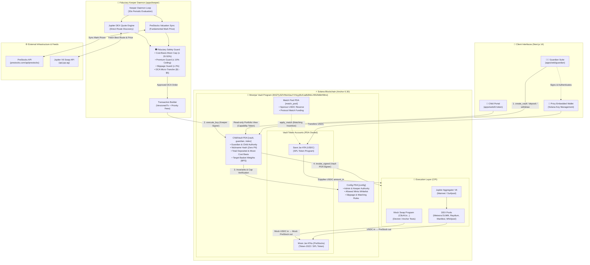

# 🍯 Moonjar

> **Autonomous Pre-IPO Savings Vault on Solana for kids, powered by Token-2022 PreStocks, Privy embedded wallets, and an on-chain fiduciary keeper.**

[](https://solana.com)
[](https://privy.io)
[](https://nextjs.org/)
[](https://www.anchor-lang.com/)

---

## 📖 Table of Contents

1. [What Is Moonjar?](#-what-is-moonjar)
2. [System Architecture](#-system-architecture)
3. [Three Ways to Run It](#-three-ways-to-run-it)
4. [Monorepo Structure](#-monorepo-structure)
5. [Prerequisites](#-prerequisites)
6. [Option A — Local Development with Surfpool (Recommended)](#-option-a--local-development-with-surfpool-recommended)
7. [Option B — Devnet](#-option-b--devnet)
8. [Option C — Offline Unit Tests (anchor test)](#-option-c--offline-unit-tests-anchor-test)
9. [Environment Variables Reference](#-environment-variables-reference)
10. [Core Safety Invariants](#-core-safety-invariants)
11. [Testing](#-testing)

---

## 🌟 What Is Moonjar?

Moonjar teaches children patient, long-term wealth-building by splitting savings into two on-chain jars:

- **Save Jar**: Circle USDC (stable, always accessible, never volatile)
- **Moon Jar**: Tokenized private equity (SpaceX, OpenAI, Anduril, etc.) via PreStocks on Solana Token-2022

A parent (Guardian) manages the vault via a Privy embedded Solana wallet. The child accesses their view via a private URL (`/k/<token>`) — no seed phrases, no keys, no signing.

An autonomous **Keeper bot** continuously evaluates live Jupiter DEX quotes against PreStocks fundamental mark prices and executes DCA micro-purchases (max \$5 per cycle) only when the secondary market premium is ≤ 10%.

---

## 🏛️ System Architecture

Moonjar combines consumer-grade web apps, an autonomous fiduciary off-chain daemon, live decentralized exchange routing, and on-chain Anchor smart contracts on Solana:

### 1. Component & Network Architecture



### 2. Autonomous Trade Lifecycle & Data Flow

```mermaid
sequenceDiagram
    autonumber
    actor Guardian as Guardian (Parent)
    participant Web as Guardian Web App
    participant Keeper as Autonomous Keeper
    participant PreStocks as PreStocks API
    participant Jup as Jupiter DEX / Devnet
    participant Vault as Vault Program (On-Chain)
    participant Swap as Jupiter / Mock Swap CPI

    Note over Guardian,Vault: 1. Vault Setup & Funding
    Guardian->>Web: Connect with Privy embedded wallet
    Guardian->>Vault: create_vault(child_index, basket, moon_cap_bps)
    Guardian->>Vault: deposit(amount_usdc) &rarr; Transferred to Save Jar ATA

    Note over Keeper,Swap: 2. Autonomous DCA Evaluation Cycle (Every 30s)
    Keeper->>Vault: Query on-chain ChildVault & Save Jar token balance
    Vault-->>Keeper: Return total_deposited, moon_cost_basis, basket
    Keeper->>PreStocks: Ingest fundamental mark prices (markPrice)
    Keeper->>Jup: Request swap quote ($1 - $5 USDC &rarr; target PreStock)
    Jup-->>Keeper: Return quoted_out & executionPrice

    Note over Keeper: 3. Fiduciary Safety Engine Checks
    Keeper->>Keeper: Check Moon Cap: (moon_cost_basis + in) &le; max_allowed_moon
    Keeper->>Keeper: Compute Premium: (execPrice - markPrice) / markPrice &times; 100
    alt Premium > 10% (Secondary Market Overpriced)
        Keeper-->>Keeper: SKIP / DEFER: Funds remain safe in Save Jar
    else Premium &le; 10% (Fair Value or Discounted)
        Keeper->>Vault: execute_buy(mint_out, amount_in, quoted_out, min_out, cpi_data)
        Note over Vault: 4. On-Chain Invariant Enforcement
        Vault->>Vault: Require caller == config.keeper
        Vault->>Vault: Require mint_out in allowed_mints & vault.basket
        Vault->>Vault: Require Save Jar balance &ge; amount_in
        Vault->>Vault: Require (moon_cost_basis + amount_in) &le; cap
        Vault->>Vault: Require min_out &ge; quoted_out &times; (1 - max_slippage)
        Vault->>Vault: Snapshot pre-CPI token balances
        Vault->>Swap: invoke_signed(cpi_data) as Vault PDA
        Swap-->>Vault: Complete token exchange
        Vault->>Vault: Reload & verify post-balance deltas (usdc_spent & tokens_received)
        Vault->>Vault: Update moon_cost_basis += usdc_spent
        Vault-->>Keeper: Emit Bought event
    end

    Note over Guardian,Vault: 5. Emergency Withdrawal & Graduation
    opt Guardian Emergency Exit
        Guardian->>Vault: withdraw(amount) (Always unblocked, even if paused)
    end
    opt Child Graduation (unlock_ts reached)
        Guardian->>Vault: graduate() &rarr; Custody transfers to Child authority
    end
```

---

## 🏗️ Three Ways to Run It

| Mode | What runs | Swaps execution | USDC mint used | Who uses it |
| :--- | :--- | :--- | :--- | :--- |
| **Surfpool (localnet)** | Surfpool forks mainnet on-demand at `127.0.0.1:8899` | ✅ Real Jupiter CPI (fork of mainnet pools) | Mainnet USDC (`EPjFWdd5...`) | Local developers |
| **Devnet** | Solana public devnet RPC | ✅ Real on-chain CPI via `mock_swap` pool (`C8cAUo...`) | Devnet Circle USDC (`4zMMC9...`) | Remote developers / staging |
| **Anchor unit tests** | `solana-test-validator` (blank ledger, in-process) | ✅ Offline CPI via `mock_swap` harness | Test mint (created in-test) | Rust/program developers |

### ⚡ Quick Environment Switch

Switch all workspace apps (`.env`, `apps/web/.env.local`, `apps/keeper/.env`) with a single command:

```bash
pnpm env:devnet     # Switch to Solana Devnet 🟡
pnpm env:localnet   # Switch to Surfpool Localnet 🟢
```

---

## 📁 Monorepo Structure

```
MoonJar/
├── apps/
│   ├── web/                     # Next.js 14 app — Guardian Suite + Child Portal
│   └── keeper/                  # Autonomous Keeper daemon (Jupiter on mainnet, mock_swap on devnet)
├── packages/
│   └── shared/                  # Zod types, PreStocks registry (devnet + mainnet), reading linters
├── programs/
│   ├── vault/                   # Anchor program: ChildVault PDA, cost-basis caps, swap CPI
│   └── mock-swap/               # CPI swap program on Devnet & Anchor tests (C8cAUo...)
├── runbooks/
│   └── deployment/              # Surfpool IaC runbook (deploys programs to localnet fork)
├── scripts/
│   ├── fund.ts                  # Surfpool cheatcode: airdrop 5 SOL + set USDC balance (localnet only)
│   ├── init-cluster.ts          # Initialises on-chain Config PDA (works on localnet AND devnet)
│   ├── setup-devnet-prestocks.ts # Creates mock PreStock tokens & funds Devnet swap pool
│   └── test-devnet-trade.ts     # End-to-end automated on-chain buy test on Devnet
├── tests/
│   └── vault.ts                 # Anchor integration tests — runs against test-validator
├── Anchor.toml                  # Program IDs registered for localnet and devnet
├── .env.example                 # Safe environment template without secrets
└── package.json                 # pnpm 9 workspace root
```

> **Key point**: On Mainnet/Surfpool, the keeper bot routes trades through **Jupiter Aggregator V6**. On Devnet, real AMM liquidity pools for private equity tokens do not exist, so the keeper routes through our deployed on-chain **`mock_swap`** program (`C8cAUowrquZVNxH8PpToSkzzr74fC7uorZ4VPzFgNLAE`) and mock PreStock tokens. Both pathways execute real on-chain CPIs into the vault program.

---

## 🧰 Prerequisites

- **Node.js** ≥ 18.18.0
- **pnpm** ≥ 9.0.0 → `npm install -g pnpm`
- **Anchor CLI** 1.2.0 → `avm use 1.2.0`
- **Rust** ≥ 1.75 + Solana CLI ≥ 1.18 *(needed to compile programs)*
- **Surfpool** *(needed for localnet only)* → `curl -sL https://run.surfpool.run/ | bash`

---

## 🔵 Option A — Local Development with Surfpool (Recommended)

Surfpool forks Solana mainnet on demand at `127.0.0.1:8899`. This means real mainnet USDC, real PreStock Token-2022 mints, and real Jupiter liquidity pools are all available locally with no real money involved.

### Step 1 — Install dependencies

```bash
git clone https://github.com/moonjar/moonjar.git
cd MoonJar
pnpm install
```

### Step 2 — Configure environment

Create `apps/web/.env.local` (and optionally a root `.env`) with:

```env
# Privy — get your own App ID & Secret from https://privy.io
NEXT_PUBLIC_PRIVY_APP_ID=<your_privy_app_id>
PRIVY_APP_ID=<your_privy_app_id>
PRIVY_APP_SECRET=<your_privy_app_secret>

# Surfpool localnet RPC (Solana mainnet fork at localhost)
NEXT_PUBLIC_SOLANA_NETWORK=mainnet-beta
NEXT_PUBLIC_RPC_URL=http://127.0.0.1:8899
SOLANA_RPC_URL=http://127.0.0.1:8899

# Vault program (same ID on both localnet and devnet)
NEXT_PUBLIC_VAULT_PROGRAM_ID=8Xi2Ty3i2VMsi4JauYrHoyyBcKoaBdMcLHEtZb6bHMno

# Keeper HTTP API secret (any string you choose)
KEEPER_API_SECRET=your_secret_here
```

> `NEXT_PUBLIC_SOLANA_NETWORK=mainnet-beta` is intentional when using Surfpool — it forks mainnet state, so the app uses the mainnet USDC mint (`EPjFWdd5AufqSSqeM2qN1xzybapC8G4wEGGkZwyTDt1v`).

### Step 3 — Compile Anchor programs

```bash
anchor build
```

This produces the IDL and `.so` binaries inside `target/`.

### Step 4 — Start Surfpool cluster

In a **dedicated terminal**, keep this running:

```bash
surfpool start --no-tui -y
```

### Step 5 — Deploy programs to Surfpool

```bash
surfpool run deployment -u --env localnet
```

This runs the runbook at `runbooks/deployment/main.tx`, deploying both `vault` and `mock_swap` instantly via Surfpool cheatcodes. After this, both programs exist on your local fork at their canonical program IDs.

### Step 6 — Initialise the on-chain Config PDA

This registers the keeper authority and the allowed PreStocks mints on-chain. It auto-detects the mainnet USDC mint when pointing to Surfpool:

```bash
pnpm init-cluster
```

Expected output:
```
🌙 Moonjar Cluster Config Initializer
Solana RPC: http://127.0.0.1:8899
Config PDA: <address>
Match Pool PDA: <address>
⚡ Initializing Global Config on-chain...
🎉 Global Config successfully initialized! Tx: <signature>
```

> If you see `✅ Config already initialized on cluster.` — you're good, no action needed.

### Step 7 — Fund your wallet with SOL + USDC

The `pnpm fund` script uses Surfpool's `surfnet_setTokenAccount` cheatcode to instantly set token balances without a real faucet. **This only works on Surfpool localnet.**

```bash
pnpm fund <YOUR_SOLANA_WALLET_ADDRESS> 500

# Example (replace with your Privy embedded wallet address):
pnpm fund BBNyzG9Kn1xf8ZFbwK2nKr3XW4MGr4XE8pQ9iJ1rsi57 500
```

This gives the wallet 5 SOL (for gas) and $500 USDC.

### Step 8 — Run the web app and keeper

```bash
# Run both simultaneously:
pnpm dev

# Or individually:
pnpm dev:web      # Next.js on http://localhost:3000
pnpm dev:keeper   # Keeper daemon (polls every 30s)
```

Open [http://localhost:3000](http://localhost:3000). Log in via Privy, create a child vault, and the keeper will automatically evaluate PreStock valuations every 30 seconds.

---

## 🟡 Option B — Devnet

Run Moonjar against Solana's public Devnet with mock SPL PreStock tokens and the deployed `mock_swap` pool program. This allows full end-to-end testing of the web app, vault creation, deposits, withdrawals, and **autonomous keeper execution** on a public Solana cluster.

### Step 1 — Switch to Devnet configuration

Run the switch script to automatically update your `.env`, `apps/web/.env.local`, and `apps/keeper/.env`:

```bash
pnpm env:devnet
```

This configures:
- `NEXT_PUBLIC_SOLANA_NETWORK=devnet`
- `NEXT_PUBLIC_RPC_URL=https://api.devnet.solana.com`
- `NEXT_PUBLIC_USDC_MINT=4zMMC9srt5Ri5X14GAgXhaHii3GnPAEERYPJgZJDncDU` (Circle Devnet USDC)
- `NEXT_PUBLIC_VAULT_PROGRAM_ID=8Xi2Ty3i2VMsi4JauYrHoyyBcKoaBdMcLHEtZb6bHMno`

### Step 2 — (Already Deployed) Program IDs on Devnet

Both programs are already compiled, deployed, and verified on Solana Devnet:

| Program | Program ID | Notes |
| :--- | :--- | :--- |
| **`vault`** | `8Xi2Ty3i2VMsi4JauYrHoyyBcKoaBdMcLHEtZb6bHMno` | Main ChildVault contract |
| **`mock_swap`** | `C8cAUowrquZVNxH8PpToSkzzr74fC7uorZ4VPzFgNLAE` | Swap pool harness for devnet execution |

*(Optional)* If you ever need to redeploy:
```bash
anchor build
anchor deploy --provider.cluster devnet
```

### Step 3 — Initialise Config & Devnet PreStocks

1. **Initialize Global Config PDA:**
   ```bash
   pnpm init-cluster
   ```
   Auto-detects Devnet and binds Circle Devnet USDC.

2. **Initialize Devnet PreStocks & Fund the Mock Swap Pool:**
   ```bash
   pnpm setup:devnet-prestocks
   ```
   This script creates/verifies the 7 mock SPL PreStock tokens, mints test tokens to the Admin wallet, funds the Devnet `mock_swap` pool PDA with 50,000 units of each asset, and registers them in the vault's on-chain `allowed_mints`.

### Step 4 — Fund your wallet with SOL & Devnet USDC

1. **Devnet SOL:**
   ```bash
   solana airdrop 2 <YOUR_WALLET_ADDRESS> --url devnet
   ```
2. **Devnet USDC:**
   Get Circle USDC on Solana Devnet from the official [Circle Devnet Faucet](https://faucet.circle.com/) (select Solana Devnet).

### Step 5 — Run an automated trade test or start the apps

- **Quick Automated Devnet Trade Test:**
  ```bash
  pnpm test:devnet-trade
  ```
  Deposits into a test vault, computes the simulated quote, executes `execute_buy` on Devnet via CPI to `mock_swap`, and verifies token balances.

- **Start Web App + Keeper Daemon:**
  ```bash
  pnpm dev
  ```
  - Web UI: [http://localhost:3000](http://localhost:3000)
  - Keeper daemon: polls every 30 seconds, automatically checks cost-basis caps and valuation premiums, and executes trades on Devnet!

---

## 🔬 Option C — Offline Unit Tests (anchor test)

The Anchor test suite in `tests/vault.ts` runs against a blank `solana-test-validator` spun up automatically by `anchor test`. Because there is no mainnet fork and no Jupiter liquidity, it uses the `mock_swap` program as a CPI swap target instead.

```bash
anchor test
```

`mock_swap` is a minimal two-leg SPL token transfer program. It lets the tests verify all on-chain invariants (cost-basis caps, keeper auth, slippage guards, etc.) without needing internet or live DEX pools.

**You never need to manually deploy `mock_swap`** — `anchor test` compiles and deploys both programs to a fresh in-process test validator automatically.

---

## ⚙️ Environment Variables Reference

| Variable | Used by | Description |
| :--- | :--- | :--- |
| `NEXT_PUBLIC_PRIVY_APP_ID` | Web app | Your Privy App ID (get one at privy.io) |
| `PRIVY_APP_ID` | Web API routes | Same Privy App ID (server-side) |
| `PRIVY_APP_SECRET` | Web API routes | Privy App Secret for server-side verification |
| `NEXT_PUBLIC_SOLANA_NETWORK` | Web app | `mainnet-beta` (for Surfpool) or `devnet` |
| `NEXT_PUBLIC_RPC_URL` | Web app | Solana RPC — `http://127.0.0.1:8899` (Surfpool) or `https://api.devnet.solana.com` |
| `NEXT_PUBLIC_VAULT_PROGRAM_ID` | Web app | Always `8Xi2Ty3i2VMsi4JauYrHoyyBcKoaBdMcLHEtZb6bHMno` |
| `NEXT_PUBLIC_USDC_MINT` | Web app | `EPjFWdd5...` (Mainnet) or `4zMMC9...` (Devnet) |
| `SOLANA_RPC_URL` | Keeper + scripts | Same RPC but for server-side keeper and init scripts |
| `KEEPER_KEYPAIR_PATH` | Keeper | Path to keeper authority keypair (default: `~/.config/solana/id.json`) |
| `KEEPER_PRIVATE_KEY` | Keeper | Raw JSON keypair bytes (alternative to keypair file, useful for CI/Docker) |
| `FORCE_BUY` | Keeper | Set `true` to bypass the 10% premium guard (dev/testing only, disabled in production) |
| `KEEPER_API_SECRET` | Web API `/api/keeper` | Shared secret required in `x-keeper-secret` header to trigger the HTTP keeper endpoint |

---

## 🔒 Core Safety Invariants

| # | Invariant | Enforcement |
| :--- | :--- | :--- |
| 1 | **Cost-basis Moon Cap** | On-chain Anchor constraint: `moon_cost_basis + amount_in ≤ total_deposited × moon_cap_bps / 10000`. Default 20%, hard max 50% on-chain. |
| 2 | **10% Premium Ceiling** | Keeper computes `(executionPrice - markPrice) / markPrice × 100`. Rejects trade if > 10%. |
| 3 | **Slippage Guard** | On-chain: verifies `min_out ≥ quoted_out × (10000 - max_slippage_bps) / 10000`. |
| 4 | **Keeper-Only Execution** | `execute_buy` requires signer matches `config.keeper`. Non-keeper callers receive `NotKeeper` error. |
| 5 | **Guardian Withdrawals Always Open** | Pausing (`set_paused`) blocks keeper buys but never blocks guardian withdrawals. |
| 6 | **Allowed Mints Whitelist** | `create_vault` and `set_basket` entries must all be in `config.allowed_mints`. Rejects `MintNotAllowed`. |
| 7 | **Cluster-Aware PreStock Mints** | Dynamic derivation of devnet vs mainnet mint addresses preventing uninitialized mint lookups. |
| 8 | **Wallet-Scoped Local State** | Browser storage keyed to `moonjar_vault_state_<guardianWallet>`. Old global key is purged on load. |

---

## 🧪 Testing

```bash
# Anchor on-chain integration tests (uses mock_swap, runs on test-validator):
anchor test

# Automated on-chain trade test on Solana Devnet:
pnpm test:devnet-trade

# Shared package unit tests (Zod schemas, linters, Flesch-Kincaid):
pnpm --filter @moonjar/shared test

# Next.js production build + TypeScript check:
pnpm --filter @moonjar/web build

# TypeScript check across all workspaces:
pnpm --recursive run build
```

---

## 📄 License

MIT © Moonjar Contributors
