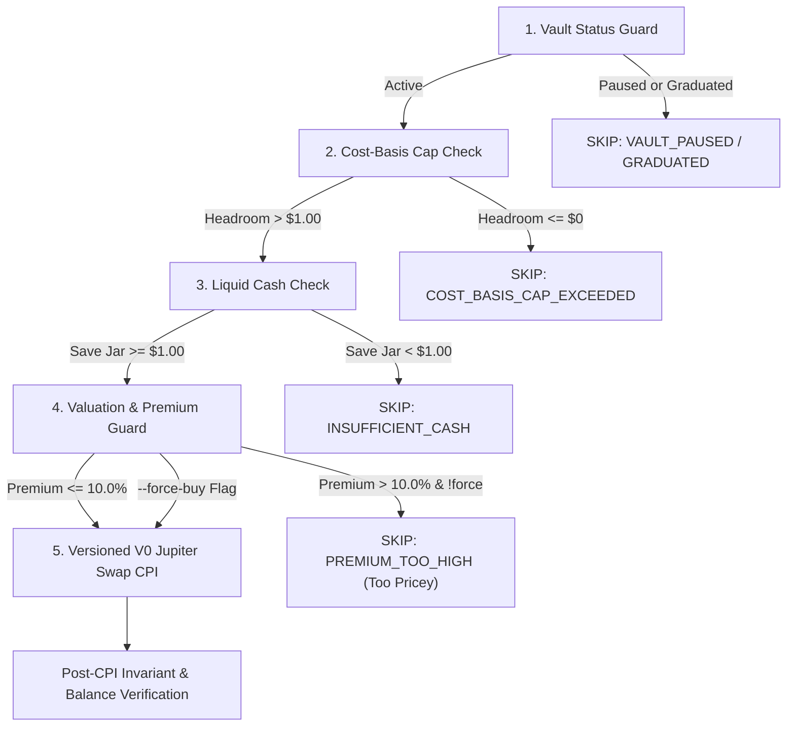

# 🌙 Moonjar Autonomous Keeper Service (`@moonjar/keeper`)

> An autonomous agentic fiduciary daemon that monitors on-chain child savings vaults, enforces mathematical safety caps, evaluates secondary DEX market valuations against fundamental PreStocks mark prices, and executes disciplined micro-purchases via Jupiter V6 on Solana.

---

## 📖 Table of Contents

1. [Overview](#-overview)
2. [5-Stage Fiduciary Evaluation Pipeline](#-5-stage-fiduciary-evaluation-pipeline)
3. [The 10% Valuation Safety Rule](#-the-10-valuation-safety-rule)
4. [Versioned Transactions (v0) & Address Lookup Tables](#-versioned-transactions-v0--address-lookup-tables)
5. [Configuration & Environment Variables](#-configuration--environment-variables)
6. [Usage & Commands](#-usage--commands)
7. [Supported PreStocks Token-2022 Mints](#-supported-prestocks-token-2022-mints)
8. [Decision Log Format](#-decision-log-format)

---

## 🤖 Overview

The Moonjar Keeper acts as an autonomous fiduciary for every registered `ChildVault`. Running as a persistent background daemon or triggered on demand, it scans on-chain vaults and determines whether secondary market conditions warrant allocating Save Jar USDC into Moon Jar assets.

---

## 🔍 5-Stage Fiduciary Evaluation Pipeline



### Detailed Evaluation Steps:
1. **Vault Status Guard**: Halts immediately if the guardian paused the vault (`isPaused`) or if the child has reached graduation age.
2. **Cost-Basis Cap Headroom Check**: Enforces `(totalDeposited * moonCapBps / 10000) - moonCostBasis > 0`. If the Moon Jar cost basis has reached the guardian's ceiling (e.g. 20%), the keeper refuses further allocation.
3. **Disciplined Micro-Batch Sizing**: Slices trade amount to:
   $$\text{tradeAmountUsdc} = \min(5.00, \text{headroom}, \text{saveBalanceUsdc})$$
   It will never allocate more than $5.00 in a single cycle (DCA discipline) and requires at least $1.00 liquid USDC in the Save Jar.
4. **Valuation Premium Guard (The 10% Safety Rule)**: Compares live secondary DEX quotes against fundamental mark price.
5. **Versioned V0 Jupiter Swap Execution**: Compiles a Versioned Transaction with Address Lookup Tables, executing the swap through on-chain CPI while verifying slippage and balance invariants.

---

## 🛡️ The 10% Valuation Safety Rule

Private company secondary tokens on decentralized exchanges often trade with volatile liquidity spikes. To protect children from paying inflated prices:

1. The Keeper queries the **PreStocks Fundamental Registry** (`prestocks.com/api/prestocks`) to obtain the canonical share mark valuation.
2. It fetches the live **Jupiter V6 DEX Quote** (`quote-api.jup.ag/v6/quote`) for the target PreStock asset.
3. It computes the effective secondary execution price per share and calculates the premium percentage:
   $$\text{Premium \%} = \frac{\text{Execution Price} - \text{Mark Price}}{\text{Mark Price}} \times 100$$
4. **Safety Trigger**:
   - If $\text{Premium} \le 10.0\%$, the purchase is approved.
   - If $\text{Premium} > 10.0\%$, the keeper records `PREMIUM_TOO_HIGH` ("Too pricey") and aborts the purchase. Funds remain safe in USDC.

---

## ⚡ Versioned Transactions (v0) & Address Lookup Tables

Solana legacy transactions have a strict **1,232-byte MTU limit**. Modern Jupiter DEX routing (especially through Meteora DLMM, Raydium, and multi-hop routes) easily involves 30+ accounts, causing legacy transactions to reach over 1,600 bytes and fail with `Transaction too large`.

The Moonjar Keeper addresses this by:
- Compiling **Versioned Transactions (v0)** with Address Lookup Tables (ALTs).
- Compressing raw transaction payload size from **1,658 bytes down to ~510 bytes**.
- Setting compute unit limits to `800,000` via `ComputeBudgetProgram.setComputeUnitLimit` for multi-hop execution.

---

## ⚙️ Configuration & Environment Variables

| Variable | Default | Description |
| :--- | :--- | :--- |
| `SOLANA_RPC_URL` | `http://127.0.0.1:8899` | Solana RPC endpoint (Surfpool local mainnet fork or devnet/mainnet) |
| `KEEPER_KEYPAIR_PATH` | `~/.config/solana/id.json` | Path to the keeper authority Solana keypair |
| `KEEPER_PRIVATE_KEY` | *(optional)* | Base58 or JSON byte array for headless/Docker deployments |
| `FORCE_BUY` | `false` | Set to `true` to override the 10% premium ceiling for testing |

---

## 💻 Usage & Commands

```bash
# 1. Run persistent daemon (polls cluster every 30 seconds):
pnpm --filter @moonjar/keeper dev

# 2. Run one-shot scan across all on-chain vaults:
npx tsx apps/keeper/src/index.ts --once

# 3. Force buy (bypasses 10% premium ceiling for testing live swaps):
npx tsx apps/keeper/src/index.ts --once --force-buy

# 4. Trigger evaluation for a specific vault via HTTP API:
curl -X POST http://localhost:3000/api/keeper \
  -H "Content-Type: application/json" \
  -d '{"vaultAddress": "<VAULT_PDA>", "forceBuy": true}'
```

---

## 🪙 Supported PreStocks Token-2022 Mints

All supported PreStocks assets on Solana are Token-2022 mints with 9 decimals:

| Company | Symbol | Mint Address |
| :--- | :--- | :--- |
| **SpaceX** | `SPACEX` | `PreANxuXjsy2pvisWWMNB6YaJNzr7681wJJr2rHsfTh` |
| **Anduril** | `ANDURIL` | `PresTj4Yc2bAR197Er7wz4UUKSfqt6FryBEdAriBoQB` |
| **Figure AI** | `FIGUREAI` | `PreZad18qfPtbxNpMtMuAuX2zVpvkEU8DnJx56faCWd` |
| **Anthropic** | `ANTHROPIC` | `Pren1FvFX6J3E4kXhJuCiAD5aDmGEb7qJRncwA8Lkhw` |
| **OpenAI** | `OPENAI` | `PreweJYECqtQwBtpxHL171nL2K6umo692gTm7Q3rpgF` |
| **Kalshi** | `KALSHI` | `PreLWGkkeqG1s4HEfFZSy9moCrJ7btsHuUtfcCeoRua` |
| **Polymarket** | `POLYMARKET` | `Pre8AREmFPtoJFT8mQSXQLh56cwJmM7CFDRuoGBZiUP` |

---

## 📋 Decision Log Format

The keeper records structured JSON audit logs adhering to the `BuyDecisionLog` interface:

```json
{
  "id": "dec-1727113800000",
  "timestamp": "2026-09-28T14:30:00.000Z",
  "vaultAddress": "5W4iP2Jz78R5Kz4vHkWz3VzB1x...",
  "symbol": "SPACEX",
  "action": "BUY",
  "premiumPct": 4.8,
  "amountInUsdc": 5000000,
  "amountOutTokens": 16516401,
  "machineReason": "PREMIUM_ACCEPTABLE (4.8% <= 10.0%)",
  "humanReasonKid": "Pip found a fair price for SpaceX and tucked a new piece into your Moon Jar!",
  "humanReasonGuardian": "Executed algorithmic purchase for SPACEX at 4.8% premium. $5.00 allocated from Save Jar.",
  "txSignature": "4nZt8k..."
}
```
